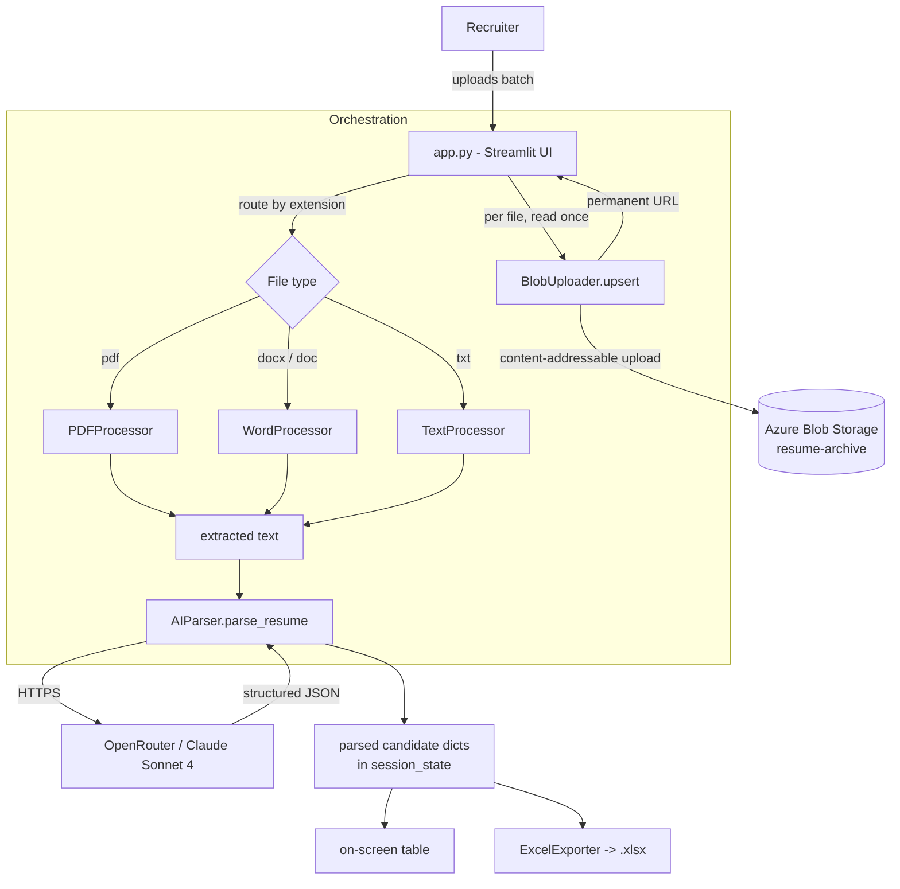

# Resume Parser 2.0

A Streamlit web app that bulk-extracts structured candidate data from resumes
(PDF, DOCX, legacy DOC, TXT) using an LLM, archives the original files to Azure
Blob Storage, and exports the results to Excel. It runs per-country (AU / MY)
with locale-aware phone-number standardization.

---

## Overview

Recruiters upload a batch of resumes; the app extracts the raw text from each
file, sends it to Claude Sonnet 4 (via OpenRouter) for structured parsing,
optionally archives the original file to Azure Blob Storage, displays the
results in a table, and lets the user download an Excel report.

The app degrades gracefully: **without Azure secrets it behaves exactly as a
local parser** (no archiving, no durable links); **with Azure secrets** it
additionally stores every uploaded file and records a permanent URL.

---

## Key features

- **Multi-format extraction** — PDF, DOCX, legacy DOC (via `antiword`), and TXT.
- **LLM parsing** — Claude Sonnet 4 over OpenRouter returns a fixed JSON schema.
- **Per-country pipelines** — separate `AU` and `MY` tabs, each with its own
  session state and phone-number country code (`+61` / `+60`).
- **Work-history ordering** — most-recent-first roles (3 slots) with auto-
  calculated tenure (e.g. `Jan 2025 - Jan 2026 (1 year)`).
- **Phone standardization** — numbers normalized to E.164.
- **Content-addressable archiving** — files deduplicated by SHA-256 in Azure
  Blob Storage; the permanent blob URL is the source of truth.
- **Excel export** — one-click `.xlsx` download with the parsed columns.
- **Batch guardrail** — hard cap of 300 files per batch.

---

## Architecture



### Per-file processing flow (`process_resumes`)

1. **Read once** — `data = uploaded_file.getvalue()` (non-consuming, so the
   processors can still read the stream).
2. **Archive-first** — if Azure is configured, `BlobUploader.upsert(...)` stores
   the file and returns `(permanent_url, blob_path)`. Upload failures are
   **fail-soft**: a warning is shown and processing continues.
3. **Extract text** — routed by file extension to the matching processor.
4. **AI parse** — `AIParser.parse_resume(text)` returns the structured record.
5. **Attach source** — `filename` is set to the permanent blob URL when archived,
   otherwise the original filename.
6. **Collect** — the record is appended to per-country `st.session_state`.

---

## Components

| File | Responsibility |
|------|----------------|
| `app.py` | Streamlit UI, per-country tabs, batch orchestration, archive-first loop, results table, Excel download trigger, credential/secrets checks. |
| `pdf_processor.py` | Extracts text from PDFs with **PyPDF2** (no OCR). |
| `word_processor.py` | Extracts `.docx` via **python-docx**; legacy `.doc` via the **antiword** CLI (system package). |
| `text_processor.py` | Decodes `.txt` uploads, trying multiple encodings. |
| `ai_parser.py` | Builds the parsing prompt, calls **Claude Sonnet 4 via OpenRouter** with retry/backoff, parses & validates the JSON, computes tenure, standardizes phone numbers to E.164 per country. |
| `excel_exporter.py` | Renders the parsed records to a styled `.xlsx` with **openpyxl**. |
| `blob_uploader.py` | Content-addressable Azure Blob archiving with skip-if-exists dedup; returns the permanent blob URL. Returns `None` (disabled) when the SDK or secrets are absent. |
| `requirements.txt` | Python dependencies (pip / Streamlit Cloud). |
| `packages.txt` | System packages for Streamlit Cloud — contains `antiword` for legacy `.doc`. |
| `package.json` | Convenience npm scripts (`start`) to launch Streamlit. |

---

## Parsed data schema

Each candidate is a flat dictionary with these keys (empty string when unknown):

```
role type, full name, first name, last name, mobile, email,
duration 1, job title 1, company 1,
duration 2, job title 2, company 2,
duration 3, job title 3, company 3,
location
```

Plus runtime fields added during processing:

- `filename` — permanent blob URL (archived) or original filename (fallback).
- `blob_path` — `"{country}/{sha256}{ext}"` when archived.

Ordering rule: slot 1 = most recent role by end date; slots 2 and 3 progressively
older. `duration N` includes an auto-appended tenure label.

---

## Azure Blob archiving design

- **Layout** — one private/public container `resume-archive`, content-addressable:
  `path = {country}/{sha256(bytes)}{ext}` (e.g. `AU/<hash>.pdf`).
- **Dedup** — the SHA-256 of the file bytes is the path, so identical files are
  stored once regardless of filename or upload time.
- **Metadata** — original filename and an ISO upload timestamp are stored as blob
  metadata (not in the path), so dedup survives renames.
- **Upsert / idempotent** — `upsert()` skips re-upload if the blob already exists
  and returns its URL; concurrent uploads are handled via `ResourceExistsError`.
- **Source of truth** — the bare permanent blob URL is stored in `Source File`.
- **Auth** — account-key auth via an Azure connection string.
- **Graceful degradation** — `BlobUploader.from_secrets()` returns `None` when the
  Azure SDK is missing or secrets are absent; the app then runs without archiving.
- The configured uploader is cached as a process-wide singleton
  (`@st.cache_resource`) so Streamlit reruns don't repeatedly hit the storage account.

---

## Configuration (secrets)

Set these in `.streamlit/secrets.toml` (local) or the Streamlit Cloud secrets UI:

```toml
# Required for AI parsing (OpenRouter key for Claude Sonnet 4)
CLAUDE_SONNET_4_API_KEY = "sk-or-..."

# Optional — enables Azure Blob archiving. Omit to run without archiving.
AZURE_STORAGE_CONNECTION_STRING = "DefaultEndpointsProtocol=https;AccountName=...;AccountKey=...;EndpointSuffix=core.windows.net"
AZURE_BLOB_CONTAINER = "resume-archive"
```

- Without `CLAUDE_SONNET_4_API_KEY`, the **Process Resumes** button is disabled.
- Without the Azure secrets, archiving is skipped and a subtle note is shown.

---

## Installation & running

**Prerequisites:** Python 3.12, and (for legacy `.doc`) the `antiword` system
binary on PATH.

```bash
# 1. Install Python dependencies
pip install -r requirements.txt

# 2. Add secrets at .streamlit/secrets.toml (see Configuration above)

# 3. Run
python -m streamlit run app.py
# or
npm start
```

The app opens in the browser with two tabs (**AU**, **MY**). Upload resumes,
click **Process Resumes**, review the table, then **Download Excel Report**.

---

## Deployment

- **Streamlit Community Cloud** — point it at this repo. `requirements.txt`
  installs Python deps; `packages.txt` installs the `antiword` apt package for
  legacy `.doc` support. Add secrets via the Streamlit Cloud secrets UI.
- **Local Windows** — install `antiword` and add it to PATH, or re-save `.doc`
  files as `.docx`.

---

## External dependencies

- **OpenRouter** (`https://openrouter.ai`) — gateway to the `anthropic/claude-sonnet-4`
  model used for parsing.
- **Azure Blob Storage** — optional file archive.
- **antiword** — system binary for legacy `.doc` text extraction.
